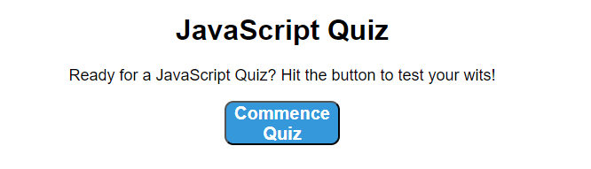
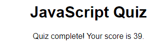

# JavaScript Quiz

## Description

This webpage holds a Dynamic JavaScript quiz. The user has 60 seconds to answer fundamental JavaScript questions and is scored based on the speed of completion. It features a HighScore List stored locally, allowing users to compete to beat their high scores.  

## Visuals

The following image shows the web application's appearance and functionality:

The following <a href="https://essence1987.github.io/Quiz/">Link</a> takes you to the page.

**Note** This mockup may not fully match the current page's design or functionality. 

## Support
If you have issues with broken links or web accessibility issues, please send me a message at hwmelander@gmail.com.

## Contributing
This is considered a personal project, and I will not accept collaboration requests for this webpage. However, if you want to invite me to contribute to a stand-alone project, don't hesitate to get in touch with me. You can find my contact information under the Support section.

## Authors and acknowledgment
Thank you to makeareadme.com for providing this template.

## License
N/A

## Known Bugs
This project currently has issues with the countdown clock not displaying as intended though it continues to count down in the background. 

I temporarily removed the HighScore system from the Main Branch. The current way I implemented it broke the site, and I deleted it to restart it from scratch. I hope to have it fixed and uploaded to the main branch.

## Project status
This project is considered a work in progress.